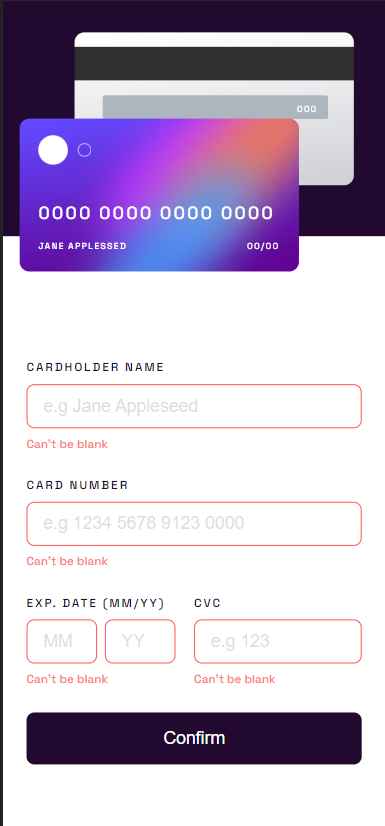
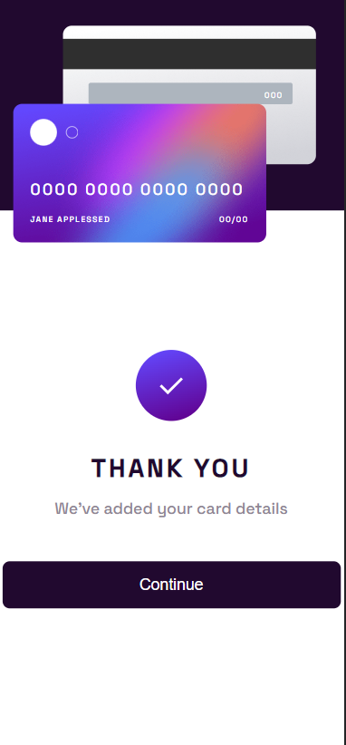

# Frontend Mentor - Interactive card details form solution

This is a solution to the [Interactive card details form challenge on Frontend Mentor](https://www.frontendmentor.io/challenges/interactive-card-details-form-XpS8cKZDWw). Frontend Mentor challenges help you improve your coding skills by building realistic projects. 

## Overview

### The challenge

Users should be able to:

- Fill in the form and see the card details update in real-time
- Receive error messages when the form is submitted if:
  - Any input field is empty
  - The card number, expiry date, or CVC fields are in the wrong format
- View the optimal layout depending on their device's screen size
- See hover, active, and focus states for interactive elements on the page

### Screenshot

### Links

- Solution URL: [Solution URL here](https://www.frontendmentor.io/solutions/interactive-card-details-form-with-react-k7fEUjoji0)
- Live Site URL: [Live site URL here](https://64c95b0d318e4c0094a677af--glistening-nasturtium-6f81b3.netlify.app/)

## My process

### Built with

- Semantic HTML5 markup
- CSS custom properties
- Flexbox
- CSS Grid
- Mobile-first workflow
- [React](https://reactjs.org/) - JS library

## Author

- Website - [Guney Unay](https://www.guneyunay.com)
- Frontend Mentor - [@unaygney](https://www.frontendmentor.io/profile/unaygney)

